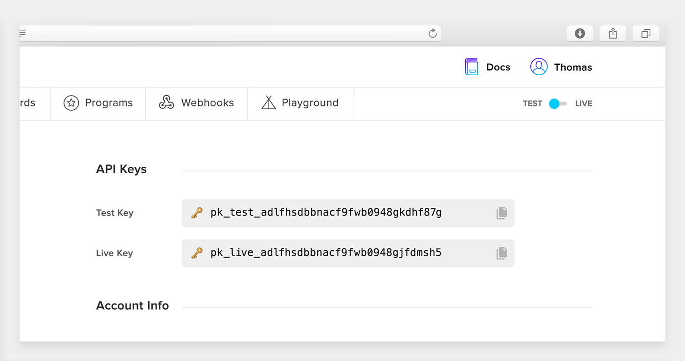

## Getting Started

**FIDEL API** helps you collect payment card details in minutes on iOS, Android and Web by using native SDKs. We developed customizable UI using iFrames so you don't have to handle sensitive information on your servers.

Card numbers are instantly tokenized and we return to you a unique token that identify each successfully linked card on your database.

 

# Step 1: Create Account
Before getting started with the integration you need to **create a FIDEL API account** that will give you access to the dashboard, card-linked program configuration, playground environment and API keys.  

 

# Step 2: Get API Key
Your test API Key is available on the FIDEL dashboard on your account page. You should start by copying the test key that will allow you to test your integration on mobile or web code and create test transactions from the [API Playground](fidel.uk).

<h5>Your API keys are shown in your account page.</h5>

 

When you're ready to go live with your integration and test with plastic credit/debit cards on VISA and Mastercard networks you can request access to the live key by using the test-live switch on your dashboard.

 

# Step 3: Install SDKs
You can find the open-source Web SDK on our [Github page](https://github.com/FidelLimited) and contribute to improve documentation and SDK functionality. Use our pre-built web UI to collect user's card number and link their card to your program without the need of additional security implementations on your server-side code.

We are working on two native SDKs for mobile, iOS and Android, that will be available in the next few weeks.

 

    

        

            
            <h2>Mobile</h2>
            <h3>Coming soon... We are working on iOS and Android native SDKs</h3>
        

    

    

        

            
            <h2>Web</h2>
            <h3>Easily link cards on your website using the Javascript SDK</h3>
        

    

 

Please follow the specific [Web SDK](/web) integration guide to learn how to configure and customize the web form to collect card number and expiry date on your website.

 

___
### Help?
If you have any questions please contact us by [email](mailto:developer@fidel.uk) or talk with our developers in the [Slack channel](fidel.uk).

 
