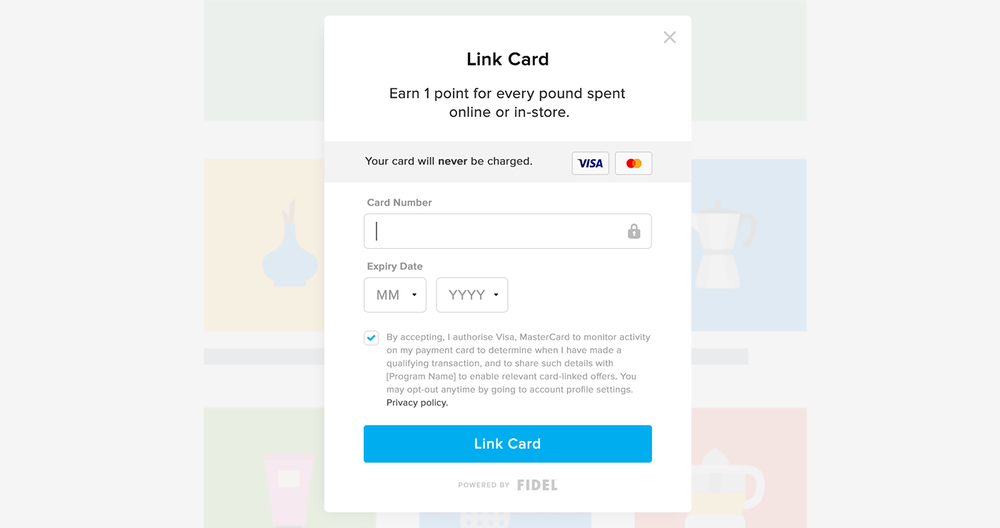

## Web SDK
**FIDEL Web SDK** is a secure HTML iFrame with customisable pre-built UI that allows you to easily collect credit card details, tokenize and link credit and debit cards with loyalty services from your website or e-commerce platform. By using FIDEL Web SDK, card details are sent directly to Fidel through a secure connection without exposing your servers to sensitive information taking care of all PCI compliance requirements for you.

<h5>Preview of FIDEL card-linking Web SDK</h5>



<br/>

After successfully tokenizing and linking the card on Visa or MasterCard networks, Fidel returns a unique token that you use to map each unique card to your user's account. You can now create card-linked web applications with online-to-offline marketing capabilities in a matter of minutes.

All modern desktop and mobile browsers are supported, including Chrome, Firefox, Safari, Microsoft IE and Edge. Please contact us at [developer@fidel.uk](mailto:developer@fidel.uk) if you experience any browser issues.

<br/>

# Integrating Web SDK
You can easily integrate FIDEL Web SDK in your website with only a few lines (or one) of code.

<h5>FIDEL card-linking Web SDK integration code</h5>

```html
fileName:index.html
<script src="https://resources.fidel.uk/js/v1/fidel.js" class="fidel-form"
    data-api-key="pk_test_b6be7025-5dca-4426-b95a-f122d72da972"
    data-program-id="1e09d8bc-3f19-4a57-ad87-8b9ad9beb7de"
    data-title="Link Card"
    data-subtitle="Earn 1 point for every £1 spent online or in-store."
    data-logo="https://brand-logo.png"
    data-lang="en"
    data-button-color="#ffffff"
    data-button-title="Link Card"
    data-button-title-color="#000000">
</script>
```
<br/>


To connect FIDEL Web SDK to your FIDEL API account and Program you will need to add your test API Key to the `data-api-key` attribute and add a **programId** to the `data-program-id` attribute. When you want to go live a link real cards on Visa and Mastercard networks you will need to replace the test key for your live key.

The FIDEL Web SDK can be customised to better fit your website. You can provide a title, subtitle and logo by using the attributes `data-title`, `data-subtitle` and `data-logo`. Also, the action button can be customised by changing it's background color, title, and title color by using the attributes `data-button-color`, `data-button-title` and `data-button-title-color`.

<br/>

# Handling the response
Work in progress...


<br/>

___

### Help?
If you have any questions please contact us by [email](mailto:developer@fidel.uk) or talk with our developers in the [Slack channel](fidel.uk).

<br/>
